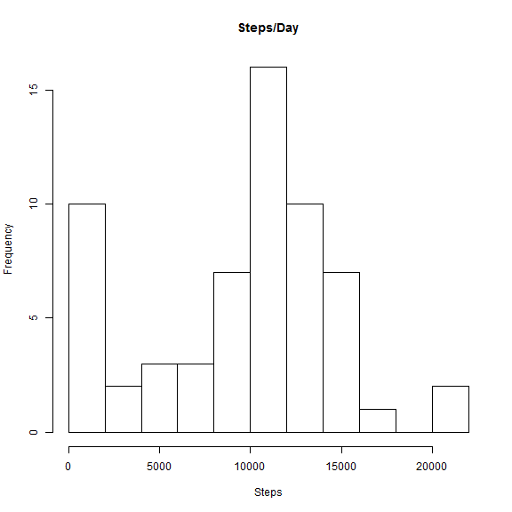
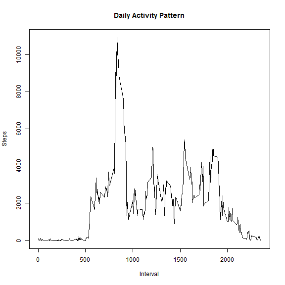
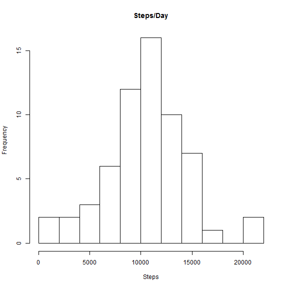
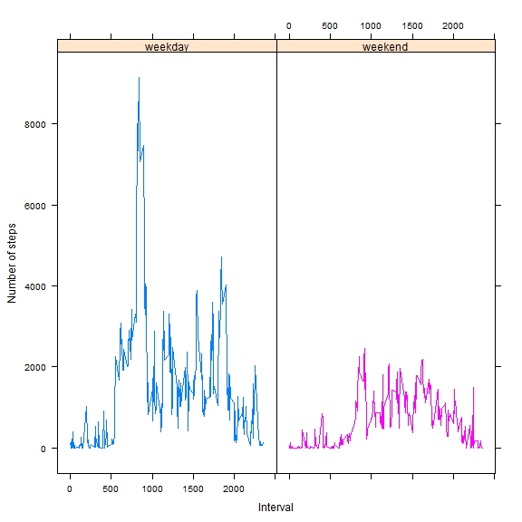

Reproducible Research - Project 1
================================
### 2014-05-18


The analysis was performed with R version 3.1.0 (1) and Rstudio version 0.98.501 (2). 


```r
> require(stats)
```

### Session information

```r
> sessionInfo()
```

```
R version 3.1.0 (2014-04-10)
Platform: x86_64-w64-mingw32/x64 (64-bit)

locale:
[1] LC_COLLATE=English_United States.1252 
[2] LC_CTYPE=English_United States.1252   
[3] LC_MONETARY=English_United States.1252
[4] LC_NUMERIC=C                          
[5] LC_TIME=English_United States.1252    

attached base packages:
[1] stats     graphics  grDevices utils     datasets  methods   base     

other attached packages:
[1] knitr_1.5

loaded via a namespace (and not attached):
[1] evaluate_0.5.5 formatR_0.10   fortunes_1.5-2 stringr_0.6.2 
[5] tools_3.1.0   
```


## Loading and preprocessing the data

### Working directory

```r
> setwd("E:/Courses/Coursera/Reproducible Research/Peer Assessments/Project1")
```

### Data

The data is from a personal activity monitoring device. This device collects data at 5 minute intervals throughout the day. The data consists of two months of data from an anonymous individual collected during the months of October and November, 2012 and include the number of steps taken in 5 minute intervals each day (3).


```r
> dat0 <- read.csv("activity.csv", header = T)
```

### Convert string to Date

```r
> dat0$Date2 <- as.Date(as.character(dat0$date), "%m/%d/%Y")
```

## What is mean total number of steps taken per day?

### October

The Date() function (4) was used to initialize Date vectors.


```r
> Date = function(length = 0) {
+     newDate = numeric(length)
+     class(newDate) = "Date"
+     return(newDate)
+ }
> fecha <- Date(31)
> stps <- numeric(31)
> for (j in 1:31) {
+     d <- ifelse(j <= 9, paste(" ", j, sep = ""), as.character(j))
+     e <- paste("2012-10-", d, sep = "")
+     fecha[j] <- as.Date(e)
+     tmp <- subset(dat0, Date2 == fecha[j])
+     stps[j] <- sum(tmp$steps, na.rm = T)
+ }
> Oct <- data.frame(fecha, stps)
```

### November

```r
> fecha <- Date(30)
> stps <- numeric(30)
> for (j in 1:30) {
+     d <- ifelse(j <= 9, paste(" ", j, sep = ""), as.character(j))
+     e <- paste("2012-11-", d, sep = "")
+     fecha[j] <- as.Date(e)
+     tmp <- subset(dat0, Date2 == fecha[j])
+     stps[j] <- sum(tmp$steps, na.rm = T)
+ }
> Nov <- data.frame(fecha, stps)
```

### combine dataframes

```r
> dat1 <- rbind(Oct, Nov)
```

### Histogram, mean, median with NAs

```r
> hist(dat1$stps, breaks = 10, main = "Steps/Day", xlab = "Steps")
```



```r
> mean(dat1$stps)
```

```
[1] 9354
```

```r
> median(dat1$stps)
```

```
[1] 10395
```

The mean number of steps taken per day with NAs is 9354 and the median number of steps taken per day is 10395.

## What is the average daily activity pattern?

```r
> Int <- unique(dat0$interval)
> IntN <- length(Int)
> stps <- numeric(IntN)
> for (j in 1:IntN) {
+     tmp <- subset(dat0, interval == Int[j])
+     stps[j] <- sum(tmp$steps, na.rm = T)
+ }
> Tmp <- data.frame(Int, stps)
> plot(Int, stps, type = "l", xlab = "Interval", ylab = "Steps", main = "Daily Activity Pattern")
```



```r
> which.max(stps)
```

```
[1] 104
```

```r
> stps[104]
```

```
[1] 10927
```

```r
> Int[104]
```

```
[1] 835
```


The 104th 5-minute interval, 835, contains the maximum number of steps, 10927, across all the days in the dataset.

## Imputing missing values

Imputation was performed with the mice() function of the mice package version 2.21 (5).


```r
> Mice
```

```
function(dataframe,Seed=0){
 DFNAME <- paste(deparse(substitute(dataframe)))
 cat("\n        Mice (imputacion multiple)\n\n")
 cat("data: ",DFNAME,"\n\n")
 if(Seed==0) Seed <- sample(9999,1)
 require(mice,quietly=T)
 print(tmp <- mice(dataframe,seed=Seed))
 return(xyz <- complete(tmp))
 detach("package:mice")
}
```

```r
> function(dataframe, Seed = 0) {
+     DFNAME <- paste(deparse(substitute(dataframe)))
+     cat("\n        Mice (imputacion multiple)\n\n")
+     cat("data: ", DFNAME, "\n\n")
+     if (Seed == 0) 
+         Seed <- sample(9999, 1)
+     require(mice, quietly = T)
+     print(tmp <- mice(dataframe, seed = Seed))
+     return(xyz <- complete(tmp))
+     detach("package:mice")
+ }
```

```
function(dataframe, Seed = 0) {
    DFNAME <- paste(deparse(substitute(dataframe)))
    cat("\n        Mice (imputacion multiple)\n\n")
    cat("data: ", DFNAME, "\n\n")
    if (Seed == 0) 
        Seed <- sample(9999, 1)
    require(mice, quietly = T)
    print(tmp <- mice(dataframe, seed = Seed))
    return(xyz <- complete(tmp))
    detach("package:mice")
}
```

```r
> dat2 <- Mice(dat0[, c(1, 2, 3)], Seed = 6039)
```

```

        Mice (imputacion multiple)

data:  dat0[, c(1, 2, 3)] 
```

```
mice 2.21 2014-02-05
```

```

 iter imp variable
  1   1  steps
  1   2  steps
  1   3  steps
  1   4  steps
  1   5  steps
  2   1  steps
  2   2  steps
  2   3  steps
  2   4  steps
  2   5  steps
  3   1  steps
  3   2  steps
  3   3  steps
  3   4  steps
  3   5  steps
  4   1  steps
  4   2  steps
  4   3  steps
  4   4  steps
  4   5  steps
  5   1  steps
  5   2  steps
  5   3  steps
  5   4  steps
  5   5  steps
Multiply imputed data set
Call:
mice(data = dataframe, seed = Seed)
Number of multiple imputations:  5
Missing cells per column:
   steps     date interval 
    2304        0        0 
Imputation methods:
   steps     date interval 
   "pmm"       ""       "" 
VisitSequence:
steps 
    1 
PredictorMatrix:
         steps date interval
steps        0    1        1
date         0    0        0
interval     0    0        0
Random generator seed value:  6039 
```

### Convert string to Date

```r
> dat2$Date2 <- as.Date(as.character(dat2$date), "%m/%d/%Y")
```

### October

```r
> Date = function(length = 0) {
+     newDate = numeric(length)
+     class(newDate) = "Date"
+     return(newDate)
+ }
> fecha <- Date(31)
> stps <- numeric(31)
> for (j in 1:31) {
+     d <- ifelse(j <= 9, paste(" ", j, sep = ""), as.character(j))
+     e <- paste("2012-10-", d, sep = "")
+     fecha[j] <- as.Date(e)
+     tmp <- subset(dat2, Date2 == fecha[j])
+     stps[j] <- sum(tmp$steps, na.rm = T)
+ }
> Oct <- data.frame(fecha, stps)
```

### November

```r
> fecha <- Date(30)
> stps <- numeric(30)
> for (j in 1:30) {
+     d <- ifelse(j <= 9, paste(" ", j, sep = ""), as.character(j))
+     e <- paste("2012-11-", d, sep = "")
+     fecha[j] <- as.Date(e)
+     tmp <- subset(dat2, Date2 == fecha[j])
+     stps[j] <- sum(tmp$steps, na.rm = T)
+ }
> Nov <- data.frame(fecha, stps)
```

### Combine dataframes 

```r
> dat3 <- rbind(Oct, Nov)
```

### Histogram, mean, median without NAs

```r
> hist(dat3$stps, breaks = 10, main = "Steps/Day", xlab = "Steps")
```



```r
> mean(dat3$stps)
```

```
[1] 10415
```

```r
> median(dat3$stps)
```

```
[1] 10395
```

The mean number of steps taken per day with missing values imputed is 10415 and the median number of steps taken per day is 10395.

What is the impact of imputing missing data on the estimates of the total daily number of steps? Calculated with the NAs the mean value is inferior to the media value which indicates negative sesgo. Calculated with the missing values imputed the mean value approximates approximates the median value which indicates better degree of symmetry.

## Are there differences in activity pattern between weekdays and weekends?

```r
> dat2$Date2 <- as.Date(as.character(dat2$date), "%m/%d/%Y")
> dat2$day <- weekdays(dat2$Date2)
> dat2$type <- ifelse(dat2$day == "Saturday" | dat2$day == "Sunday", "end", "week")
```

### Subsets

```r
> End <- subset(dat2, type == "end")
> Week <- subset(dat2, type == "week")
```

### Weekday

```r
> Int <- unique(dat2$interval)
> IntN <- length(Int)
> stps <- numeric(IntN)
> for (j in 1:IntN) {
+     tmp <- subset(Week, interval == Int[j])
+     stps[j] <- sum(tmp$steps, na.rm = T)
+ }
> TmpW <- data.frame(Int, stps)
> TmpW$type <- "weekday"
```

### Weekend

```r
> Int <- unique(dat2$interval)
> IntN <- length(Int)
> stps <- numeric(IntN)
> for (j in 1:IntN) {
+     tmp <- subset(End, interval == Int[j])
+     stps[j] <- sum(tmp$steps, na.rm = T)
+ }
> TmpE <- data.frame(Int, stps)
> TmpE$type <- "weekend"
```

### Combine dataframes

```r
> dat3 <- rbind(TmpE, TmpW)
```

### Plot

The xyplot() function of the lattice package was used (6).


```r
> require(lattice)
```

```
Loading required package: lattice
```

```r
> xyplot(stps ~ Int | as.factor(type), groups = as.factor(type), type = "l", xlab = "Interval", 
+     ylab = "Number of steps", main = "", data = dat3)
```



There is greater activity on weekends then on weekdays.

## List of References

(1) R Core Team (2014). R: A language and environment for statistical computing. R 
Foundation for Statistical Computing, Vienna, Austria. URL http://www.R-
project.org/ 

(2) RStudio Version 0.98.501 - © 2009-2013 RStudio, Inc. URL 
https://www.rstudio.com/ 

(3) Dataset: Activity monitoring data
URL https://d396qusza40orc.cloudfront.net/repdata%2Fdata%2Factivity.zip
consulted 5/6/2014

(4) Stack Overflow. R - how do I declare a vector of Date? URL 
http://stackoverflow.com/questions/6777116/r-how-do-i-declare-a-vector-of-date
Jul 21 2011 consulted 5/15/2014

(5) van Buuren S, Groothuis-Oudshoorn K (2011). mice: Multivariate Imputation by 
Chained Equations in R. Journal of Statistical Software, 45(3), 1-67. URL 
http://www.jstatsoft.org/v45/i03/ 

(6) Sarkar, Deepayan (2008) Lattice: Multivariate Data Visualization with R.
Springer, New York. ISBN 978-0-387-75968-5


